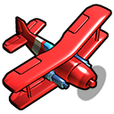

# Altitude Docker Server

This is a docker image for running an [Altitude](https://altitudegame.com/index.html) game server.

# Usage
To get the image, simply pull the image from [Docker Hub](https://hub.docker.com/):

`docker run stephen1000/altitude-server`

Note: All configuration is handled via environment variables, so running the image as-is will just use the default values. You won't be an admin on your server or be able to change any settings. You can pass environment variables directly to the `docker run` command using the `-e` flag, or create a `docker-compose.yaml` file. There's an example [in the repository](docker-compose.yaml).

# Configuration
Configuration is possible by passing environment values to the image at runtime. The script [build_config.py](scripts/build_config.py) provides this capability by leveraging the python library [Jinja2](https://jinja.palletsprojects.com/). All environment variables beginning with the prefix `ALTITUDE` are automatically provided to the template context and applied to the [base template](config/env_config.xml). 

## Environment Variables
A number of environment values are required in order to run the a server. These can be modified to change the server's behavior. Below is a table listing each.

Boolean values must be specified as a lower case string equivalent (e.g. True is "true", False is "false"). Lists are specified as comma-separated values. No mechanism is provided at this time for escaping commas within lists, so don't use commas in list values!

### Common settings
| Environment variable            | Description                                                    | Default Value   |
| --------------------            | -----------                                                    | -------------   |
| ALTITUDE_PORT                   | Port to host server on                                         | 27275           |
| ALTITUDE_UPDATE_PORT            | Port to use to update server                                   | 27276           |
| ALTITUDE_SERVER_NAME            | Name of server (as will appear on master list)                 | Altitude Server |
| ALTITUDE_MAX_PLAYER_COUNT       | Maximum number of players allowed                              | 14              |
| ALTITUDE_AUTO_BALANCE_TEAMS     | Whether to automatically balance teams                         | true            |
| ALTITUDE_ENABLE_RCON            | Whether to allow Remote calls                                  | false           |
| ALTITUDE_RCON_PASSWORD          | Password for Remote calls                                      | \<blank\>       |
| ALTITUDE_SECRET_CODE            | Password for Server (if blank, server will be public)          | \<blank\>       |
| ALTITUDE_ADMIN_UUIDS            | List of UUIDs that will be granted Admin status.               | \<blank\>       |
| ALTITUDE_MAP_LIST               | List of map types to allow                                     | ball,ffa,tbd,tdm|
| ALTITUDE_MAP_ROTATION           | List of map types to include in map rotation                   | ball,ffa,tbd,tdm|
| ALTITUDE_HARDCORE               | Whether to use hardcore mode                                   | true            |
| ALTITUDE_PREVENT_TEAM_SWITCHING | Whether to prevent team switching                              | false           |
| ALTITUDE_DISABLE_BALANCE_POPUP  | Whether to disable team balance popup                          | false           |
| ALTITUDE_LAN_SERVER             | Whether to disable remote connections (not recommended)        | false           |
| ALTITUDE_CALL_END_OF_ROUND_VOTE | Whether to call a vote for the next map at end of rounds       | true            |
| ALTITUDE_MAX_PING               | Maximum allowed ping for players                               | 350             |
| ALTITUDE_MIN_LEVEL              | Minimum allowed player level                                   | 0 (diasbled)    |
| ALTITUDE_MAX_LEVEL              | Maximum allowed player level                                   | 0 (disabled)    |
| ALTITUDE_CAMERA_SCALE_PERCENT   | Camera view scale percentage                                   | 100             |
| ALTITUDE_BOT_COUNT              | Number of bots to include                                      | 2               |
| ALTITUDE_BOT_DIFFICULTY         | Bot difficulty (one of EASY | MEDIUM | HARD | EXPERT)          | MEDIUM          |
| ALTITUDE_BOTS_BALANCE_TEAMS     | Whether bots are used to balance teams                         | true            |

### Free for All (ffa)
| Environment variable            | Description                                                    | Default Value   |
| --------------------            | -----------                                                    | -------------   |
| ALTITUDE_FFA_SCORE              | Points required to win a round of Free for All                 | 0 (no limit)    |
| ALTITUDE_FFA_ROUNDS             | Rounds to play on Free for All games                           | 1               |
| ALTITUDE_FFA_ROUND_TIME         | How long Free for All rounds last                              | 420             |
| ALTITUDE_FFA_WARMUP             | How long Free for All warmup lasts (seconds)                   | 10              |

### Objective
| Environment variable            | Description                                                    | Default Value   |
| --------------------            | -----------                                                    | -------------   |
| ALTITUDE_OBJ_GAMES              | How many objective games per round                             | 9               |
| ALTITUDE_OBJ_PER_SWITCH         | How many objective games before switching sides                | 2               |
| ALTITUDE_OBJ_MARGIN             | Margin needed to win objective games                           | 1               |
| ALTITUDE_OBJ_BETWEEN_GAMES      | Time waited inbetween objective games                          | 6               |
| ALTITUDE_OBJ_ROUNDS             | Rounds to play in Objective games                              | 1               |
| ALTITUDE_OBJ_ROUND_TIME         | Round time for objective games                                 | 0 (disabled)    |
| ALTITUDE_OBJ_WARMUP             | Warmup time for objective games                                | 10              |

### Plane Ball (ball)
| Environment variable            | Description                                                    | Default Value   |
| --------------------            | -----------                                                    | -------------   |
| ALTITUDE_BALL_GOALS             | Goals to win a plane ball game                                 | 11              |
| ALTITUDE_BALL_ROUNDS            | Plane ball rounds to play                                      | 1               |
| ALTITUDE_BALL_ROUND_TIME        | How long plane ball rounds last                                | 0               |
| ALTITUDE_BALL_WARMUP            | Warmup time for Plane Ball                                     | 10              |

### Team Deathmatch (tdm)
| Environment variable            | Description                                                    | Default Value   |
| --------------------            | -----------                                                    | -------------   |
| ALTITUDE_TDM_SCORE              | Score to win a Team Deathmatch game                            | 0               |
| ALTITUDE_TDM_ROUNDS             | Rounds of Team Deathmatch to play                              | 1               |
| ALTITUDE_TDM_ROUND_TIME         | How long Team Deathmatch games last                            | 600             |
| ALTITUDE_TDM_WARMUP             | Warmup time for Team Deathmatch                                | 10              |

# Contributing
Send PRs my way and I'll take a look! 

The docker file could probably use some cleaning up, and the config builder script would benefit from some tests. Any other ideas are welcome, too!

# Acknowledgements
Thanks to [Nimbly Games](http://nimblygames.com/) for creating Altitude, along with a robust and easy to use server!